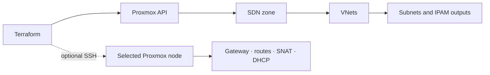

<h1 align="center">Proxmox SDN Terraform module</h1>

<p align="center">
  <strong>Build Proxmox SDN zones, VNets and subnets with Terraform—using API-only networking or optional gateway, SNAT, DHCP and static-route orchestration.</strong>
</p>

<p align="center">
  <a href="https://registry.terraform.io/modules/hybridops-tech/sdn/proxmox/latest"></a>
  <a href="https://github.com/hybridops-tech/terraform-proxmox-sdn/actions/workflows/terraform-validate.yml"></a>
</p>

<p align="center">
  <a href="https://registry.terraform.io/modules/hybridops-tech/sdn/proxmox/latest">Terraform Registry</a> ·
  <a href="https://docs.hybridops.tech/howto/networking/HOWTO-proxmox-sdn-terraform/">Documentation</a> ·
  <a href="examples">Examples</a> ·
  <a href="ROADMAP.md">Roadmap</a>
</p>

A purpose-built Terraform module for Proxmox VE SDN. It keeps the operating boundary explicit: use the Proxmox API for zone, VNet and subnet objects, then opt into host orchestration when the selected node should also provide gateway, routing, SNAT or DHCP services.



The multi-node reference path has been exercised across three cluster members: the VNet was available to a disposable guest on each node, the guests reached the external gateway and one another, and the runner completed the operation through API requests while SSH to the node subnet remained blocked.

## What the module manages

- a VLAN-backed Proxmox SDN zone;
- one or more VNets and subnets;
- single-node or cluster-wide zone membership;
- optional host-side L3, SNAT, DHCP and static routes;
- SDN apply, host-state reconciliation and scoped cleanup; and
- structured subnet and IPAM outputs for downstream consumers.

## Operating modes

| Mode | Proxmox responsibility | External responsibility | Access |
|---|---|---|---|
| API-only edge-routed | SDN zone, VNets and subnet metadata | Gateways, routing, DHCP, firewall policy and upstream access | Proxmox API only |
| Host-routed | SDN plus gateway addresses, optional SNAT, DHCP and static routes | Any routing or policy not declared through this module | Proxmox API and root SSH to one node |
| Cluster edge-routed | Shared zone and VNet membership across several nodes | L3 services and upstream routing | Proxmox API; optional SSH to one node for apply and status hooks |

Host-side features are intentionally limited to one Proxmox node. A
`proxmox_nodes` list with more than one member requires `enable_host_l3 = false`.

## Requirements

- Terraform `>= 1.5.0`.
- Proxmox VE 8.x with SDN enabled.
- A VLAN-aware bridge, normally `vmbr0`.
- `bpg/proxmox >= 0.50.0` and `hashicorp/null >= 3.2.0`.
- A dedicated Proxmox API token with access to the managed SDN objects.

Host-routed mode also requires:

- `ssh` and `scp` on the Terraform runner;
- non-interactive root SSH access to `proxmox_host`; and
- dnsmasq on the Proxmox node when DHCP is enabled.

## Quick start

This API-only example creates one edge-routed VNet without logging in to the
Proxmox host. The subnet gateway is retained as SDN metadata; an external
router must provide the actual gateway and related services.

```hcl
terraform {
  required_version = ">= 1.5.0"

  required_providers {
    proxmox = {
      source  = "bpg/proxmox"
      version = ">= 0.50.0"
    }
  }
}

provider "proxmox" {
  endpoint  = var.proxmox_url
  api_token = var.proxmox_token
  insecure  = var.proxmox_insecure
}

module "sdn" {
  source  = "hybridops-tech/sdn/proxmox"
  version = "~> 0.1.6"

  zone_name    = "apionly"
  proxmox_node = "pve1"

  enable_host_orchestration = false
  enable_host_l3            = false
  enable_snat               = false
  enable_dhcp               = false

  vnets = {
    vapimgmt = {
      vlan_id     = 210
      description = "Management network"

      subnets = {
        mgmt = {
          cidr    = "10.210.0.0/24"
          gateway = "10.210.0.1"
        }
      }
    }
  }

  proxmox_url      = var.proxmox_url
  proxmox_token    = var.proxmox_token
  proxmox_insecure = var.proxmox_insecure
}
```

Initialise and review the plan before applying it:

```text
terraform init
terraform plan
terraform apply
```

Do not commit API tokens or populated `terraform.tfvars` files.

If this module solves a problem in your Proxmox environment, star the repository to follow new releases.

## Host-routed configuration

Host-routed mode makes the selected Proxmox node the gateway for each declared
subnet. SNAT, DHCP and static routes remain independently configurable.

```hcl
module "sdn" {
  source  = "hybridops-tech/sdn/proxmox"
  version = "~> 0.1.6"

  zone_name    = "hybzone"
  proxmox_node = "pve1"
  proxmox_host = "192.0.2.10"

  enable_host_l3 = true
  enable_snat    = true
  enable_dhcp    = true

  vnets = {
    vnetmgmt = {
      vlan_id     = 10
      description = "Management network"

      subnets = {
        mgmt = {
          cidr             = "10.10.0.0/24"
          gateway          = "10.10.0.1"
          dhcp_range_start = "10.10.0.120"
          dhcp_range_end   = "10.10.0.220"
          dhcp_dns_server  = "1.1.1.1"
        }
      }
    }
  }

  proxmox_url      = var.proxmox_url
  proxmox_token    = var.proxmox_token
  proxmox_insecure = var.proxmox_insecure
}
```

When module-level DHCP is enabled, DHCP is enabled for each subnet unless that
subnet sets `dhcp_enabled = false`. Missing ranges and DNS values are derived
from the module defaults.

## VNet schema

Zone and VNet IDs must start with a letter, contain only letters and digits,
and be between two and eight characters long. Subnet map keys are local
Terraform identifiers and do not have the same Proxmox naming restriction.

```hcl
vnets = {
  vnetmgmt = {
    vlan_id     = 10
    description = "Management network"

    subnets = {
      mgmt = {
        cidr             = "10.10.0.0/24"
        gateway          = "10.10.0.1"
        dhcp_enabled     = true
        dhcp_range_start = "10.10.0.120"
        dhcp_range_end   = "10.10.0.220"
        dhcp_dns_server  = "1.1.1.1"
      }
    }
  }
}
```

## Inputs

### SDN and access

| Name | Type | Default | Description |
|---|---|---:|---|
| `zone_name` | `string` | required | Proxmox SDN zone ID. |
| `zone_bridge` | `string` | `"vmbr0"` | Bridge used by the VLAN zone. |
| `proxmox_node` | `string` | `""` | Single node membership; used when `proxmox_nodes` is empty. |
| `proxmox_nodes` | `list(string)` | `[]` | Cluster node membership; takes precedence over `proxmox_node`. |
| `proxmox_host` | `string` | `""` | Host reached by SSH when host orchestration is enabled. |
| `vnets` | `map(object)` | required | VNet and subnet declarations described above. |
| `proxmox_url` | `string` | required | Proxmox API URL. |
| `proxmox_token` | `string` | required, sensitive | Proxmox API token. |
| `proxmox_insecure` | `bool` | `false` | Disable TLS verification for the Proxmox API. |

Set either `proxmox_node` or `proxmox_nodes`. When host orchestration is
enabled, `proxmox_host` is also required.

### Host orchestration

| Name | Type | Default | Description |
|---|---|---:|---|
| `enable_host_orchestration` | `bool` | `true` | Enable SSH-based apply, recovery and cleanup hooks. |
| `enable_host_l3` | `bool` | `true` | Assign gateway addresses to VNet interfaces. |
| `enable_snat` | `bool` | `true` | Add per-subnet masquerade rules through `uplink_interface`. |
| `uplink_interface` | `string` | `"vmbr0"` | Host interface used for SNAT. |
| `host_static_routes` | `list(object)` | `[]` | Destination CIDR and next-hop pairs installed on the host. |
| `host_reconcile_nonce` | `string` | `""` | Operator value that forces host-state reconciliation on the next apply. |

When `enable_host_orchestration = false`, also disable host L3, SNAT and DHCP,
and leave `host_static_routes` empty.

### DHCP and IPAM output

| Name | Type | Default | Description |
|---|---|---:|---|
| `enable_dhcp` | `bool` | `false` | Manage per-subnet dnsmasq services; requires host L3. |
| `dns_domain` | `string` | `"hybridops.local"` | DHCP DNS suffix. |
| `dns_lease` | `string` | `"24h"` | dnsmasq lease duration. |
| `dhcp_default_dns_server` | `string` | `"8.8.8.8"` | Default DNS server for DHCP-enabled subnets. |
| `dhcp_default_start_host` | `number` | `120` | Default first host index in a DHCP pool. |
| `dhcp_default_end_host` | `number` | `220` | Default last host index in a DHCP pool. |
| `ipam_site` | `string` | `"onprem-hybridhub"` | Site value included in `ipam_prefixes`. |
| `ipam_status` | `string` | `"active"` | Status value included in `ipam_prefixes`. |
| `static_last_host` | `number` | `119` | Last static host index used in generated descriptions. |

## Outputs

| Name | Description |
|---|---|
| `zone_name` | Managed Proxmox SDN zone ID. |
| `vnets` | VNet IDs, zone membership and VLAN tags. |
| `subnets` | Effective subnet, gateway and DHCP values. |
| `ipam_prefixes` | Structured prefix and DHCP metadata for downstream IPAM consumers. |

Inspect structured outputs with:

```text
terraform output -json vnets
terraform output -json subnets
terraform output -json ipam_prefixes
```

## Ownership and lifecycle

### Existing SDN objects

Matching names do not transfer existing Proxmox objects into Terraform state.
For a brownfield environment, choose one of these boundaries before the first
apply:

1. create a new module-owned zone;
2. define and import the complete existing zone, VNet and subnet set; or
3. leave the existing objects externally managed.

Review the first plan after an import for replacement and deletion actions.
Avoid importing only the parent zone while its VNets or subnets remain under a
different ownership model.

### Reconciliation

Host-side setup is driven by Terraform resource changes. If the declared
topology is unchanged but gateway, NAT, DHCP or route state has drifted, set a
new one-time value:

```hcl
host_reconcile_nonce = "CHG-20260809-01"
```

Leave the applied value in configuration and change it only when another
forced reconciliation is required. Do not change unrelated inputs merely to
trigger host reconciliation.

### Destroy scope

Destroy removes SDN objects represented in the module state and the host-side
gateway, route, NAT and DHCP artefacts tagged for that zone. It is not a
cluster-wide network reset and does not intentionally remove unrelated zones,
bridges, firewall rules or DHCP services.

Destroy is disruptive to workloads attached to the managed VNets. Review the
destroy plan and move or stop dependent workloads first. Proxmox VNet
interfaces may remain visible until SDN networking is reloaded.

## Examples

| Example | Purpose |
|---|---|
| [`api-only-edge-routed`](examples/api-only-edge-routed) | API-only zone with routing owned externally. |
| [`basic`](examples/basic) | Single VNet with host L3, SNAT and DHCP. |
| [`no-dhcp`](examples/no-dhcp) | Host L3 and SNAT with static guest addressing. |
| [`homelab-six-vlans`](examples/homelab-six-vlans) | Six-VLAN segmented reference layout. |
| [`multi-node`](examples/multi-node) | Shared edge-routed zone across cluster nodes. |

See the [examples index](examples/README.md) for variables and validation
instructions.

## Validation

The root tests use mocked providers and do not require a live Proxmox endpoint.

```text
terraform fmt -check -recursive
terraform init -backend=false -input=false
terraform validate -no-color
terraform test -no-color
```

Validate each modified example separately. Live changes should also be planned
against a non-production Proxmox environment before release.

## Documentation and support

- [Proxmox SDN with Terraform](https://docs.hybridops.tech/howto/networking/HOWTO-proxmox-sdn-terraform/)
- [Network architecture](https://docs.hybridops.tech/guides/getting-started/20-network-architecture/)
- [VLAN allocation strategy](https://docs.hybridops.tech/adr/ADR-0101-vlan-allocation-strategy/)
- [Changelog](CHANGELOG.md)
- [Roadmap](ROADMAP.md)
- [Issues](https://github.com/hybridops-tech/terraform-proxmox-sdn/issues)

## Contributing

See [CONTRIBUTING.md](CONTRIBUTING.md) for the development workflow and
required validation. User-visible changes should include an appropriate
changelog entry and updated examples where relevant.

## License

Code is licensed under [MIT-0](LICENSE). Documentation is licensed under
[CC BY 4.0](https://docs.hybridops.tech/legal/documentation-license/).
